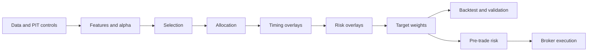

# quantcortex

> **Modular quantitative research and paper-execution platform**
> Data -> Alpha -> Portfolio -> Timing -> Risk -> Backtest -> Execution

[](https://www.python.org/)
[](LICENSE)
[](https://github.com/magnaquant/quantcortex/actions/workflows/ci.yml)

---

## Overview

**quantcortex** is a modular quantitative research platform built around a
strict **weight-centric interface contract** (inspired by FinRL-X). Every layer
- from alpha signal to broker adapter - speaks the same language: a normalized
weight vector `w_t in R^n`.

This reduces a common source of research/live drift: changing the portfolio
representation or component interfaces between backtest and execution code.

```
w_t = R_t( T_t( A_t( S_t( X<=t ) ) ) )
       ^       ^       ^       ^
     Risk   Timing  Alloc  Selection
```

**Design targets are not performance claims.** The reference strategies retain
aspirational Sharpe targets of 1.10 (multi-asset rotation) and 0.9 (momentum
ML). The published reference run below materially misses its target and both
gross benchmarks; it demonstrates the audit path rather than strategy quality.
See [PERFORMANCE.md](PERFORMANCE.md).

---

## Project Demo

The repository owner confirms permission to publish these derived charts. The
raw market-data file remains uncommitted; its digest and the complete chart
hashes are recorded in
[`performance_manifest.json`](docs/img/performance_manifest.json).


| Reference-run result | Value |
|---|---:|
| Evaluation window | 2018-01-02 to 2025-12-31 |
| Net nominal CAGR | +1.33% |
| Gross nominal CAGR before modeled costs | +3.26% |
| Net Sharpe, excess of SHV cash proxy | -0.14 |
| Gross Sharpe before modeled costs, excess of SHV | +0.15 |
| Maximum drawdown | -10.33% |
| Annualized one-way turnover | 10.84x |
| Sum of modeled cost fractions | 15.06% |
| Mean active gross exposure | 34.76% |
| Fully-cash sessions | 41.92% |
| Exposure-matched equal-initial-weight basket cash-excess Sharpe, gross | +0.69 |

Residual cash earns the adjusted-close return of SHV. Strategy returns are net
of 3 bps commission and 10 bps flat slippage per trade; benchmark returns are
gross. The positive nominal return is not evidence of positive active return:
after subtracting the cash proxy, net Sharpe is negative, and the strategy
trails an equal-initial-weight buy-and-hold basket scaled to the same daily
risky exposure. The ADV cap is inactive because this run has no volume input.
The reported DSR is
0.024 using an assumed 10 trials and a single-series variance estimate. The
true historical trial count is unknown, so this is not a validated
multiple-testing correction.

<details>
<summary><strong>Open the full diagnostic gallery</strong></summary>

### Equity Versus Benchmarks


### Performance Attribution


### Drawdown


### Rolling Sharpe


### Rolling Risk


### Allocation And Exposure


### Turnover And Costs


### Monthly Returns


### Return Distribution


</details>

The published run uses Yahoo Finance data retrieved through yfinance 1.4.1 on
June 16, 2026. It covers QQQ, VGT, GLD, TLT, SPY, VIG, and the SHV cash proxy
from January 4, 2016 through December 31, 2025; the first 503 sessions are
signal warm-up. The local adjusted-close CSV has SHA-256
`efb384a62157e56a0cd8065abf45c1ed07d90ec26c681e5d54d74fe4cb9c55e1`.
Permission is owner-asserted and not independently verified by the software.

To generate the same report from an authorized file matching that digest:

```bash
PYTHONPATH=. python scripts/generate_report.py \
  --prices-csv local_data/published_rotation_prices.csv \
  --cash-proxy-symbol SHV \
  --start 2018 --end 2025 --n-trials 10 \
  --data-provider "$DATA_PROVIDER" \
  --permission-basis "$DATA_PERMISSION_BASIS" \
  --retrieved-at "$DATA_RETRIEVED_AT" \
  --adjustment-method "$DATA_ADJUSTMENT_METHOD"
```

The command writes `reports/report.md` and the same ten-plot diagnostic set.
Metadata records owner-supplied assertions; the tool does not determine whether
a license permits publication or redistribution.

---

## Research Paper

The NeurIPS 2026-format preprint presents the accounting contract, fixed
experiment design, gross and net comparisons, dependence-aware uncertainty,
limitations, and reproducibility checklist. It is a negative-result systems
study, not a claim of profitable alpha or NeurIPS acceptance.

[Read the paper PDF](paper/quantcortex_audit_neurips2026.pdf) or review the
[LaTeX source and reproduction notes](paper/README.md).


The raw provider matrix remains local. Committed aggregate tables, figures,
input digest, generator revision, package versions, and artifact hashes are in
[`paper/results/manifest.json`](paper/results/manifest.json).

---

## Getting Started

The scientific core, test suite, broker mocks, and labeled paper-trading dry run
work offline. Research notebooks and performance reports require an explicit
real-data source; the repository does not bundle market data or silently replace
failed downloads with generated prices. Optional providers, ML libraries,
broker SDKs, and storage clients remain lazy imports.

### Install

```bash
git clone https://github.com/magnaquant/quantcortex.git
cd quantcortex
python3.11 -m venv .venv && source .venv/bin/activate

# Reproduce the reviewed development environment.
python -m pip install -r requirements/dev.lock
python -m pip install --no-deps -e .

# Optional full stack (resolved from poetry.lock):
poetry install --with test,dev -E all
#   ml        -> xgboost, lightgbm, catboost       (GBDT cross-sectional alpha)
#   nlp       -> transformers, torch               (FinBERT sentiment)
#   rl        -> stable-baselines3, gymnasium       (PPO DRL allocator)
#   regime    -> hmmlearn                           (HMM regime overlay)
#   providers -> yfinance, polygon-api-client, fredapi, lxml (data + PIT parsing)
#   brokers   -> alpaca-py, ib_async, ccxt
#   storage   -> redis, sqlalchemy, psycopg2-binary (feature cache + TimescaleDB)
```

> **macOS note:** LightGBM/XGBoost need the OpenMP runtime (`brew install
> libomp`). With `model="auto"`, an unavailable native backend is skipped in
> favor of the next backend. For reproducible research, select a concrete
> backend and pin its version.

### Run the tests

```bash
python -m pytest tests/ -q --cov=quantcortex --cov-fail-under=60
ruff check .
```

### Run the research notebooks

```bash
# Owner-supplied real data; see local_data/README.md for schemas.
export QUANTCORTEX_PRICES_CSV="$PWD/local_data/prices.csv"
export QUANTCORTEX_OHLCV_CSV="$PWD/local_data/aapl_ohlcv.csv"  # notebook 02
jupyter lab research/

# Or explicitly opt into live yfinance instead of local CSVs.
unset QUANTCORTEX_PRICES_CSV QUANTCORTEX_OHLCV_CSV
export QUANTCORTEX_LIVE_YFINANCE=1
jupyter lab research/
```

Set exactly one price source. Live yfinance use is subject to the provider's
[terms and legal disclaimer](https://ranaroussi.github.io/yfinance/); confirm
that your use is permitted. Notebook outputs are intentionally not committed.

### Validation & operations scripts

```bash
python scripts/validate_performance.py --live-yfinance
python scripts/validate_performance.py --live-yfinance --pit
python scripts/generate_report.py --prices-csv local_data/published_rotation_prices.csv --cash-proxy-symbol SHV
python scripts/generate_report.py --live-yfinance
python scripts/survivorship_demo.py --live-yfinance # quantify survivorship bias
python scripts/verify_brokers.py              # broker adapters vs faithful SDK mocks (no account)
python scripts/paper_trade_cycle.py --offline # labeled synthetic dry-run; no broker calls
```

`validate_performance.py` explicitly fetches live yfinance data; `--pit` uses a
fixed start-date cohort from historical index membership. `generate_report.py`
accepts either an owner-supplied wide CSV or explicit live yfinance, writes a
Markdown report plus ten plots under ignored `reports/`, and prints source
metadata plus markdown tables. Its default report requires at least 274
pre-evaluation sessions for full signal initialization; `--warmup-years 0`
explicitly permits and labels a cold start. `survivorship_demo.py` requires the
same explicit live-data opt-in and shows the current pricing gap for past index
members. `verify_brokers.py` checks Alpaca/IB/CCXT request construction and
response parsing against SDK-shaped mocks. CI separately constructs requests
with the real `alpaca-py` and `ib_async` SDK classes without contacting a
venue. Neither gate verifies credentials, transport, permissions, or venue
behavior.
`paper_trade_cycle.py` runs the full execution path (use
`--live-yfinance --submit` with `ALPACA_*` set to place paper orders). It
refuses unresolved open orders, records deterministic client order IDs before
submission, persists positions/orders/intents in one revisioned snapshot, and
separates sell and buy phases across fresh account snapshots. Alpaca uses
[`alpaca-py`](https://github.com/alpacahq/alpaca-py); Interactive Brokers uses
[`ib_async`](https://github.com/ib-api-reloaded/ib_async). Authenticated paper
handshakes remain an external release gate.

### Paper trading (Phase 4)

Copy `.env.example` to `.env`, add your broker credentials, and export them
before a direct CLI run (`set -a; source .env; set +a` in a trusted shell).
Then use `scripts/paper_trade_cycle.py --live-yfinance --submit` for the guarded
Alpaca paper path. `research/05_live_trading_bridge.ipynb` demonstrates order
translation and adapter wiring but does not establish authenticated live
compatibility. Copy `.env.example` to `.env`, replace `POSTGRES_PASSWORD`, then
bring up local Redis and TimescaleDB with
`docker compose up -d redis timescaledb`. The pinned application image runs as
a non-root user and consumes `requirements/runtime.lock`.

---

## Performance Reporting

The README publishes one owner-authorized reference run as derived images with
adjacent provenance and an artifact manifest. Raw market data, executed
notebook output, and ordinary local reports remain excluded. Published results
must identify their data vintage and must not be silently regenerated from a
different input file.

For a licensed local dataset, run:

```bash
PYTHONPATH=. python scripts/generate_report.py \
  --prices-csv local_data/published_rotation_prices.csv \
  --cash-proxy-symbol SHV \
  --n-trials 10  # replace 10 with the actual configurations tested
```

The report records the file path, SHA-256 digest, observed date window, cost
assumptions, signal warm-up, DSR trial count/variance assumption, and whether
liquidity constraints are active.
Each run writes `reports/report.md`, a compact `report_overview.png`, and nine
detailed diagnostics under ignored `reports/img/`. These remain local research
evidence unless the owner explicitly approves publication and adds complete
provenance plus artifact hashes. See [PERFORMANCE.md](PERFORMANCE.md) for the
reference run, interpretation requirements, and known limitations.

---

## Architecture

The platform is organized as eight layers joined by explicit data and weight
contracts. Components are replaceable when they preserve those contracts and
the surrounding data assumptions.



| Layer | Role | Key modules |
|-------|------|-------------|
| **Data** | Market, fundamental, and alternative-data adapters with PIT validation utilities | `providers/`, `pit_enforcer.py`, `lookahead_detector.py` |
| **Alpha** | Factor research, ML signals, NLP sentiment | `factors/`, `alpha158.py`, `feature_engineering/` |
| **Portfolio** | Weight optimization (MV, HRP, RL) | `equal_weight.py`, `hrp.py`, `drl_allocator.py` |
| **Timing** | Regime detection, momentum overlays | `hmm_regime.py`, `tsmom.py`, `vix_scaler.py` |
| **Risk** | Drawdown limits, VaR/CVaR, Kelly sizing | `circuit_breaker.py`, `var_cvar.py`, `vol_targeting.py` |
| **Backtest** | Walk-forward validation, pitfall detection | `walk_forward.py`, `deflated_sharpe.py`, `lookahead_audit.py` |
| **Execution** | Live broker routing, order/position mgmt | `brokers/`, `order_manager.py`, `pre_trade_risk.py` |
| **Strategies** | End-to-end select, allocate, timing, and risk pipelines | `base_strategy.py`, `multi_asset_rotation.py`, `momentum_ml.py` |

### Weight Contract

Every **portfolio optimizer** output satisfies the strict contract (enforced at
runtime by `enforce_weight_contract`):

```python
# output: np.ndarray, shape (n_assets,)
# dtype:  float64
# sum:    1.0  (long-only) or 0.0 (market-neutral)
# range:  [0.0, 1.0] long-only; [-1.0, 1.0] market-neutral
# violation raises: WeightContractViolationError
```

Timing and risk **overlays** legitimately scale gross exposure down (a fully
de-risked book is flat, a half-scaled long-only book sums to 0.5 with the
remainder in cash), so the *post-overlay* strategy output satisfies the relaxed
**exposure contract** (`enforce_exposure_contract`): finite, 1-D float64, each
weight in `[-1.0, 1.0]`, and gross (`sum |w|`) no greater than the input. In
other words, `sum == 1.0` holds at the allocation layer; `sum <= 1.0` holds
after timing and risk scaling.

---

## Repository Structure

All importable code lives under the single top-level `quantcortex` package, so
it installs and imports without colliding with any other project's modules:
`from quantcortex.portfolio.base import enforce_weight_contract`.

```
quantcortex/                     # repo root
├── quantcortex/                 # the importable package (import quantcortex.*)
│   ├── data/
│   │   ├── providers/          # base.py ABC + yfinance, Polygon, Alpaca, CCXT, FRED, FMP
│   │   ├── processors/         # calendar.py, adjustments.py, pit_enforcer.py, lookahead_detector.py
│   │   ├── storage/            # parquet_store.py, timescale_store.py, redis_cache.py
│   │   ├── universe/           # base ABC, sp500/nasdaq100 + sp500_wikipedia.py (PIT)
│   │   └── local_csv.py        # validated owner-supplied CSV loaders
│   │
│   ├── alpha/
│   │   ├── factors/
│   │   │   ├── classical/      # momentum, value, quality, low-vol (+ _cross_section helpers)
│   │   │   ├── ml/             # GBDT (XGBoost/LightGBM/CatBoost), neural
│   │   │   └── nlp/            # finbert_sentiment.py, news_scorer.py
│   │   ├── validation/         # alphalens_report.py, factor_decay.py
│   │   └── feature_engineering/ # alpha158.py, macro_features.py
│   │
│   ├── portfolio/
│   │   ├── base.py             # Abstract ABC with weight contract enforcement
│   │   ├── equal_weight.py
│   │   ├── mean_variance.py
│   │   ├── minimum_variance.py
│   │   ├── risk_parity.py
│   │   ├── hrp.py              # Hierarchical Risk Parity (López de Prado)
│   │   ├── black_litterman.py
│   │   └── drl_allocator.py    # PPO-based RL allocator
│   │
│   ├── timing/
│   │   ├── hmm_regime.py       # Hidden Markov Model regime detection
│   │   ├── vix_scaler.py       # VIX-based vol scaling
│   │   ├── tsmom.py            # Time-series momentum
│   │   └── kama.py             # Kaufman Adaptive Moving Average
│   │
│   ├── risk/
│   │   ├── circuit_breaker.py  # Hard stop on drawdown threshold
│   │   ├── var_cvar.py         # Historical & parametric VaR/CVaR
│   │   ├── vol_targeting.py    # Annualized vol targeting
│   │   ├── factor_exposure.py  # Barra-style factor exposure limits
│   │   └── kelly.py            # Fractional Kelly sizing
│   │
│   ├── backtest/
│   │   ├── engines/
│   │   │   ├── vectorized.py   # Fast NumPy/pandas vectorized engine
│   │   │   ├── event_driven.py # Bar-by-bar positions and fill accounting
│   │   │   ├── cash.py         # Strict residual-cash return alignment
│   │   │   └── walk_forward.py # Expanding/rolling WFO with embargo
│   │   ├── execution_models/
│   │   │   ├── ideal_fill.py
│   │   │   ├── vwap_fill.py
│   │   │   └── market_impact.py  # Simplified permanent/temporary impact model
│   │   ├── costs/
│   │   │   └── transaction_costs.py  # 3bps commission + 10bps slippage
│   │   ├── validation/
│   │   │   ├── deflated_sharpe.py    # Bailey & López de Prado DSR
│   │   │   ├── multiple_testing.py   # BHY correction
│   │   │   ├── lookahead_audit.py    # Perturbation-based leakage diagnostic
│   │   │   └── survivorship_check.py
│   │   └── metrics/
│   │       └── tearsheet.py    # Native performance metrics and charts
│   │
│   ├── execution/
│   │   ├── brokers/
│   │   │   ├── base.py
│   │   │   ├── alpaca_broker.py
│   │   │   ├── ib_broker.py        # Interactive Brokers via ib_async
│   │   │   └── ccxt_broker.py      # CCXT-supported crypto exchanges
│   │   ├── order_manager.py
│   │   ├── position_manager.py
│   │   ├── state_persistence.py    # Redis or atomic local-JSON state
│   │   └── pre_trade_risk.py       # Weight, order, and post-trade exposure checks
│   │
│   └── strategies/
│       ├── base_strategy.py
│       ├── momentum_ml.py          # GBDT cross-sectional momentum
│       ├── macro_timing.py         # Macro regime + asset rotation
│       ├── drl_portfolio.py        # PPO end-to-end RL portfolio
│       ├── sentiment_nlp.py        # FinBERT earnings sentiment overlay
│       └── multi_asset_rotation.py # Growth/Real Assets/Defensive rotation
│
├── research/                       # Jupyter notebooks (add repo root to sys.path)
│   ├── 01_data_quality.ipynb
│   ├── 02_factor_research.ipynb
│   ├── 03_portfolio_construction.ipynb
│   ├── 04_backtest_analysis.ipynb
│   └── 05_live_trading_bridge.ipynb
│
├── scripts/
│   ├── validate_performance.py  # explicit live-data validation (--pit: PIT universe)
│   ├── generate_report.py       # charts + markdown from an explicit data source
│   ├── paper_trade_cycle.py     # one rebalance cycle (offline / Alpaca paper)
│   ├── survivorship_demo.py     # quantify S&P 500 survivorship bias (PIT)
│   ├── run_paper_experiments.py # fixed paper tables, figures, and manifest
│   ├── build_paper.sh           # compile and publish the NeurIPS-format PDF
│   └── verify_brokers.py        # broker adapters vs faithful SDK mocks
│
├── tests/
│   ├── build_notebook_fixtures.py # deterministic test-only notebook inputs
│   ├── test_data_integrity.py
│   ├── test_factor_integrity.py
│   ├── test_execution_safety.py
│   ├── test_fail_closed_invariants.py
│   ├── test_paper_artifacts.py
│   ├── test_paper_experiments.py
│   ├── test_research_validation.py
│   ├── test_repository_data_policy.py
│   └── test_regression_guards.py  # focused guards for audited defects
│
├── local_data/README.md         # ignored local-data schemas and provenance rules
├── reports/                     # ignored generated charts and report output
├── paper/                       # NeurIPS source, results, figures, and PDF
├── docs/
│   ├── img/                     # approved reference-run plots + hash manifest
│   └── production-readiness.md  # blockers before production capital
├── docker-compose.yml
├── Dockerfile
├── pyproject.toml
├── poetry.lock
├── requirements/              # exported locks by CI/runtime use case
├── CONTRIBUTING.md
├── SECURITY.md
├── .env.example
├── .dockerignore               # excludes secrets and runtime-irrelevant artifacts
├── .gitignore
├── PERFORMANCE.md              # evaluation method and reporting requirements
└── LICENSE
```

---

## Key Design Principles

### 1. Point-in-Time (PIT) Discipline
Financial report data should use **announcement dates**, not period-end dates.
`pit_enforcer.py` rejects records that violate that contract. Date-only inputs
use strict-before matching; same-timestamp use requires an explicit opt-in for
sources with observed intraday release times.

### 2. Walk-Forward Validation with Embargo
The walk-forward engine supports expanding or rolling windows plus a purge and
embargo gap. Research code must select and use it when models are refit or
configurations are evaluated over time.

### 3. Deflated Sharpe Ratio (DSR)
The report generator includes DSR (Bailey & López de Prado, 2014) to account
for multiple testing and non-normal return distributions:

```
DSR = Phi[ (SR* - SR0)*sqrt(T-1) / sqrt(1 - gamma3*SR* + (gamma4-1)/4*SR*^2) ]
```

Where `SR*` = observed max Sharpe, `SR0` = expected max under the null,
`gamma3` = skewness, and `gamma4` = non-excess kurtosis.

### 4. Backtesting Pitfall Controls
1. **Look-ahead bias** - PIT checks enforce specific timestamp contracts; `lookahead_audit.py` is a sensitivity diagnostic, not a proof of no leakage.
2. **Overfitting** - DSR and BHY multiple-testing utilities quantify trial risk.
3. **Survivorship bias** - named index universes require explicit membership data. The Wikipedia S&P reconstruction is coverage-limited and rejects pre-coverage queries; delisted-security prices still require an appropriate feed.
4. **Data adjustment errors** - processors validate split/dividend-adjusted inputs.
5. **Multiple testing bias** - BHY correction is available for factor and strategy tests.
6. **Transaction cost neglect** - every backtest engine requires a cost model.
7. **Liquidity assumptions** - a 10% ADV cap applies only when ADV data is supplied.

### 5. Transaction Cost Model
```python
commission  = 0.0003   # 3 bps
slippage    = 0.0010   # 10 bps
volume_cap  = 0.10     # max 10% of ADV when an ADV series is supplied
```

---

## ML / AI Stack

| Technique | Use case | Module |
|-----------|----------|--------|
| XGBoost / LightGBM / CatBoost | Cross-sectional tabular-alpha baselines | `quantcortex/alpha/factors/ml/` |
| PPO (Stable-Baselines3) | End-to-end RL portfolio allocation | `quantcortex/portfolio/drl_allocator.py` |
| Hidden Markov Model | Regime detection (bull/bear/sideways) | `quantcortex/timing/hmm_regime.py` |
| FinBERT | Earnings call & news sentiment scoring | `quantcortex/alpha/factors/nlp/` |
| Hierarchical Clustering (HRP) | Robust portfolio construction without inverting covariance | `quantcortex/portfolio/hrp.py` |

---

## Strategies

### Multi-Asset Rotation (`quantcortex/strategies/multi_asset_rotation.py`)
- **Universe:** Growth (QQQ, VGT), Real Assets (GLD, TLT), Defensive (SPY, VIG)
- **Rebalance:** Weekly
- **Selection:** Information Ratio relative to QQQ
- **Allocation:** Residual momentum within selected asset groups
- **Risk gate:** seeded GMM regime by default (HMM is explicit), VIX scaling,
  and a 60% position cap that leaves residual cash when diversification is infeasible
- **Design target:** Sharpe > 1.10; this is aspirational, not a published result.

### Momentum ML (`quantcortex/strategies/momentum_ml.py`)
- GBDT cross-sectional momentum with alpha158 features
- Walk-forward refit every quarter
- **Design target:** Sharpe > 0.9; this is aspirational, not a published result.

### DRL Portfolio (`quantcortex/strategies/drl_portfolio.py`)
- PPO agent trained on rolling 3-year windows
- Observation: trailing returns plus current portfolio weights
- Action space: continuous weight vector over universe
- Reward: realized log return minus turnover cost and estimated portfolio variance
- Missing PPO dependencies and untrained models fail closed by default; the
  deterministic momentum heuristic requires explicit opt-in.

---

## Development Roadmap

Implemented research components are not equivalent to production readiness.
See [docs/production-readiness.md](docs/production-readiness.md) for the
remaining broker, state, data, deployment, and operational controls.

| Phase | Scope | Status |
|-------|-------|--------|
| **Phase 1** | Data layer + PIT enforcement + universe construction | Implemented; licensed data is still required for production research |
| **Phase 2** | Alpha factor library + walk-forward validation harness | Implemented; empirical validation remains dataset-specific |
| **Phase 3** | Portfolio construction + backtest engines + DSR reporting | Implemented; execution and cost assumptions remain model-dependent |
| **Phase 4** | Paper-execution integration | Current Alpaca/IB SDK request models, 17 broker mock checks, coherent revisioned state snapshots, and an idempotent paper-only submission path are implemented. Authenticated connectivity, account permissions, recovery drills, and venue-side behavior remain unverified. |
| **Phase 5** | DRL allocator + configurable FinBERT/lexicon sentiment overlay | Implemented as research baselines |

---

## External References

| Project | Relationship to quantcortex | Runtime dependency |
|---------|------------------------------|--------------------|
| [Qlib](https://github.com/microsoft/qlib) | Alpha158 feature names and operator conventions are reimplemented locally with documented deviations | No |
| [FinRL-X](https://github.com/AI4Finance-Foundation/FinRL-Trading) | Inspiration for the deployment-consistent, weight-centric pipeline | No |
| [Lean/QuantConnect](https://github.com/QuantConnect/Lean) | Comparative reference for event-driven architecture and broker-integrated systems | No integration |

---

## References

- Bailey, D. & López de Prado, M. (2014). *The Deflated Sharpe Ratio.* Journal of Portfolio Management.
- Yang, H. et al. (2026). *FinRL-X: An AI-Native Modular Infrastructure for Quantitative Trading.* [arXiv:2603.21330](https://arxiv.org/abs/2603.21330).
- López de Prado, M. (2018). *Advances in Financial Machine Learning.* Wiley.
- Qian, E. (2005). *Risk Parity Portfolios.* PanAgora Asset Management.

---

*MIT licensed.*
