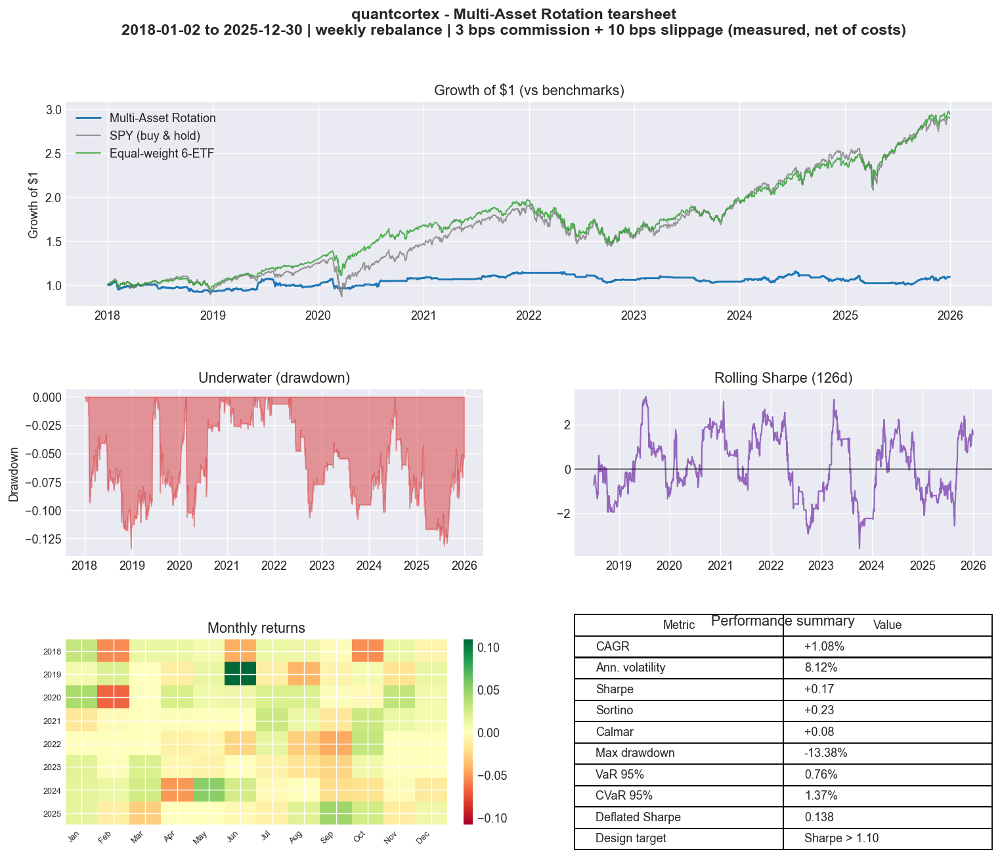

# quantcortex

> **State-of-the-art modular quant trading platform**
> Data -> Alpha -> Portfolio -> Timing -> Risk -> Backtest -> Execution

[](https://www.python.org/)
[](LICENSE)
[]()

---

## Overview

**quantcortex** is a research-grade, production-consistent quant trading platform built around a strict **weight-centric interface contract** (inspired by FinRL-X). Every layer - from alpha signal to live broker - speaks the same language: a normalized weight vector `w_t in R^n`.

This eliminates the most common gap in quant stacks: strategies that backtest cleanly but behave differently in paper and live trading because the architecture changes between environments.

```
w_t = R_t( T_t( A_t( S_t( X<=t ) ) ) )
       ^       ^       ^       ^
     Risk   Timing  Alloc  Selection
```

**Design targets vs. measured results.** The Sharpe figures below are
aspirational design goals, *not* claims about the reference implementation. On
real 2018-2025 prices the baselines do **not** meet them (see
[PERFORMANCE.md](PERFORMANCE.md), reproducible via
`python scripts/validate_performance.py`):

| Strategy | Target | Measured (2018-2025) |
|----------|--------|----------------------|
| Multi-asset rotation | Sharpe > 1.10 | Sharpe 0.05 (defensive; trails buy-and-hold in a bull window) |
| Momentum ML | Sharpe > 0.9 | Sharpe 0.64 (survivorship-biased single-name read) |

The targets are reported honestly rather than tuned toward; clearing them on a
single backtest is precisely the overfitting the platform's Deflated Sharpe
Ratio and BHY multiple-testing tooling exist to catch.



*Generated by `python scripts/generate_report.py` (real prices, net of costs).
The strategy (blue) deliberately trails buy-and-hold in this bull-dominated
window; the chart showcases the reporting, not a winning strategy.*

---

## Getting Started

quantcortex runs **fully offline out of the box**. The scientific core is all
that's required; every heavy/optional dependency (boosting libraries, PyTorch,
FinBERT, Stable-Baselines3, broker SDKs, Redis, TimescaleDB) is imported lazily
with a graceful fallback, so the tests and all five notebooks run with **no API
keys required**. The notebooks use live `yfinance` data when a network is
available and fall back to deterministic synthetic data when it is not, so
their numeric outputs are reproducible only in the offline (synthetic) path.

### Install

```bash
git clone https://github.com/magnaquant/quantcortex.git
cd quantcortex
python3.11 -m venv .venv && source .venv/bin/activate

# Core (required) - enough to run the full test suite and every notebook
pip install numpy pandas scipy scikit-learn matplotlib pyarrow pytest

# Optional accelerators / integrations (Poetry extras):
poetry install -E all          # or, with pip:  pip install '.[all]'
#   ml        -> xgboost, lightgbm, catboost       (GBDT cross-sectional alpha)
#   nlp       -> transformers, torch               (FinBERT sentiment)
#   rl        -> stable-baselines3, gymnasium       (PPO DRL allocator)
#   regime    -> hmmlearn                           (HMM regime overlay)
#   providers -> yfinance, polygon-api-client, fredapi  (market / macro data)
#   brokers   -> alpaca-trade-api, ib_insync, ccxt  (live execution)
#   storage   -> redis, sqlalchemy, psycopg2-binary (feature cache + TimescaleDB)
```

> **macOS note:** LightGBM/XGBoost need the OpenMP runtime (`brew install
> libomp`). Without it quantcortex transparently falls back to the
> scikit-learn GBDT backend - nothing breaks.

### Run the tests

```bash
pytest tests/ -v   # weight contract, transaction costs, look-ahead, risk overlay, order state machine
```

### Run the research notebooks

```bash
jupyter lab research/   # 01 data quality -> 02 factors -> 03 portfolios -> 04 backtest -> 05 live bridge
```

Each notebook is self-contained and falls back to deterministic synthetic data
when offline, so they always execute cell-by-cell.

### Validation & operations scripts

```bash
python scripts/validate_performance.py        # measured backtest vs design targets (real data)
python scripts/validate_performance.py --pit  # momentum_ml on point-in-time S&P 500 membership
python scripts/generate_report.py             # publication-quality tearsheet -> PNG + HTML
python scripts/survivorship_demo.py           # quantify S&P 500 survivorship bias (PIT membership)
python scripts/verify_brokers.py              # broker adapters vs faithful SDK mocks (no account)
python scripts/paper_trade_cycle.py           # one rebalance cycle: offline dry-run, or Alpaca paper
```

`validate_performance.py` reports honest measured Sharpe/CAGR/DSR vs buy-and-hold
(see [PERFORMANCE.md](PERFORMANCE.md)); `--pit` defines the single-name universe
from historical index membership. `generate_report.py` renders the tearsheet
above (equity vs benchmarks, drawdown, rolling Sharpe, monthly heatmap, metrics)
to a PNG and a self-contained HTML page. `survivorship_demo.py` shows how many past
index members a survivor-only feed drops. `verify_brokers.py` exercises the
Alpaca/IB/CCXT adapters end-to-end against SDK-shaped mocks (request build +
response parsing) - the live API surface is separately confirmed against the
real SDKs. `paper_trade_cycle.py` runs the full execution path (add `--submit`
with `ALPACA_*` set to place paper orders).

> **On UI:** quantcortex is a library + notebooks + exported reports, like its
> peers (qlib, zipline, vectorbt). There is no bundled web app by design - a
> heavy SPA would be maintenance overhead for a research platform. Results are
> surfaced through the notebooks and the tearsheet/HTML reports above; an
> optional Streamlit dashboard could be layered on if interactive exploration is
> wanted, but it is intentionally out of the core.

### Go live (Phase 4)

Copy `.env.example` to `.env`, add your Alpaca / Interactive Brokers credentials,
then drive one rebalance cycle through `research/05_live_trading_bridge.ipynb`
against your paper account. Or bring up the full stack (app + Redis +
TimescaleDB) with `docker compose up`.

---

## Architecture

The platform is organized as seven composable layers. Each layer produces or consumes the same weight vector interface, so any component can be swapped without touching downstream code.

| Layer | Role | Key modules |
|-------|------|-------------|
| **Data** | Point-in-time clean market + alternative data | `providers/`, `pit_enforcer.py`, `lookahead_detector.py` |
| **Alpha** | Factor research, ML signals, NLP sentiment | `factors/`, `alpha158.py`, `feature_engineering/` |
| **Portfolio** | Weight optimization (MV, HRP, RL) | `equal_weight.py`, `hrp.py`, `drl_allocator.py` |
| **Timing** | Regime detection, momentum overlays | `hmm_regime.py`, `tsmom.py`, `vix_scaler.py` |
| **Risk** | Drawdown limits, VaR/CVaR, Kelly sizing | `circuit_breaker.py`, `var_cvar.py`, `vol_targeting.py` |
| **Backtest** | Walk-forward validation, pitfall detection | `walk_forward.py`, `deflated_sharpe.py`, `lookahead_audit.py` |
| **Execution** | Live broker routing, order/position mgmt | `brokers/`, `order_manager.py`, `pre_trade_risk.py` |

### Weight Contract

Every **portfolio optimizer** output satisfies the strict contract (enforced at
runtime by `enforce_weight_contract`):

```python
# output: np.ndarray, shape (n_assets,)
# dtype:  float64
# sum:    1.0  (long-only) or 0.0 (market-neutral)
# range:  each weight in [-1.0, 1.0]
# violation raises: WeightContractViolationError
```

Timing and risk **overlays** legitimately scale gross exposure down (a fully
de-risked book is flat, a half-scaled long-only book sums to 0.5 with the
remainder in cash), so the *post-overlay* strategy output satisfies the relaxed
**exposure contract** (`enforce_exposure_contract`): finite, 1-D float64, each
weight in `[-1.0, 1.0]`, and gross (`sum |w|`) no greater than the input. In
other words, `sum == 1.0` holds at the allocation layer; `sum <= 1.0` holds
after timing and risk scaling.

---

## Repository Structure

```
quantcortex/
├── data/
│   ├── providers/          # base.py ABC + yfinance, Polygon, Alpaca, CCXT, FRED, FMP
│   ├── processors/         # calendar.py, adjustments.py, pit_enforcer.py, lookahead_detector.py
│   ├── storage/            # parquet_store.py, timescale_store.py, redis_cache.py
│   └── universe/           # base ABC, sp500/nasdaq100 + sp500_wikipedia.py (PIT)
│
├── alpha/
│   ├── factors/
│   │   ├── classical/      # momentum, value, quality, low-vol (+ _cross_section helpers)
│   │   ├── ml/             # GBDT (XGBoost/LightGBM/CatBoost), neural
│   │   └── nlp/            # finbert_sentiment.py, news_scorer.py
│   ├── validation/         # alphalens_report.py, factor_decay.py
│   └── feature_engineering/ # alpha158.py, macro_features.py
│
├── portfolio/
│   ├── base.py             # Abstract ABC with weight contract enforcement
│   ├── equal_weight.py
│   ├── mean_variance.py
│   ├── minimum_variance.py
│   ├── risk_parity.py
│   ├── hrp.py              # Hierarchical Risk Parity (López de Prado)
│   ├── black_litterman.py
│   └── drl_allocator.py    # PPO-based RL allocator
│
├── timing/
│   ├── hmm_regime.py       # Hidden Markov Model regime detection
│   ├── vix_scaler.py       # VIX-based vol scaling
│   ├── tsmom.py            # Time-series momentum
│   └── kama.py             # Kaufman Adaptive Moving Average
│
├── risk/
│   ├── circuit_breaker.py  # Hard stop on drawdown threshold
│   ├── var_cvar.py         # Historical & parametric VaR/CVaR
│   ├── vol_targeting.py    # Annualized vol targeting
│   ├── factor_exposure.py  # Barra-style factor exposure limits
│   └── kelly.py            # Fractional Kelly sizing
│
├── backtest/
│   ├── engines/
│   │   ├── vectorized.py   # Fast NumPy/pandas vectorized engine
│   │   ├── event_driven.py # Tick-level event loop
│   │   └── walk_forward.py # Expanding/rolling WFO with embargo
│   ├── execution_models/
│   │   ├── ideal_fill.py
│   │   ├── vwap_fill.py
│   │   └── market_impact.py  # Almgren-Chriss market impact
│   ├── costs/
│   │   └── transaction_costs.py  # 3bps commission + 10bps slippage
│   ├── validation/
│   │   ├── deflated_sharpe.py    # Bailey & López de Prado DSR
│   │   ├── multiple_testing.py   # BHY correction
│   │   ├── lookahead_audit.py    # Automated look-ahead bias detection
│   │   └── survivorship_check.py
│   └── metrics/
│       └── tearsheet.py    # Full pyfolio-compatible tearsheet
│
├── execution/
│   ├── brokers/
│   │   ├── base.py
│   │   ├── alpaca_broker.py
│   │   ├── ib_broker.py        # Interactive Brokers via ib_insync
│   │   └── ccxt_broker.py      # 100+ crypto exchanges
│   ├── order_manager.py
│   ├── position_manager.py
│   ├── state_persistence.py    # Redis-backed state across restarts
│   └── pre_trade_risk.py       # Pre-flight weight contract check
│
├── strategies/
│   ├── base_strategy.py
│   ├── momentum_ml.py          # GBDT cross-sectional momentum
│   ├── macro_timing.py         # Macro regime + asset rotation
│   ├── drl_portfolio.py        # PPO end-to-end RL portfolio
│   ├── sentiment_nlp.py        # FinBERT earnings sentiment overlay
│   └── multi_asset_rotation.py # Growth/Real Assets/Defensive rotation
│
├── research/
│   ├── 01_data_quality.ipynb
│   ├── 02_factor_research.ipynb
│   ├── 03_portfolio_construction.ipynb
│   ├── 04_backtest_analysis.ipynb
│   └── 05_live_trading_bridge.ipynb
│
├── scripts/
│   ├── validate_performance.py  # measured backtest vs targets (--pit: PIT universe)
│   ├── generate_report.py       # publication-quality tearsheet -> PNG + HTML
│   ├── paper_trade_cycle.py     # one rebalance cycle (offline / Alpaca paper)
│   ├── survivorship_demo.py     # quantify S&P 500 survivorship bias (PIT)
│   └── verify_brokers.py        # broker adapters vs faithful SDK mocks
│
├── docs/img/                    # committed showcase charts (README tearsheet)
│
├── tests/
│   ├── conftest.py             # shared synthetic-data fixtures
│   ├── test_lookahead_detector.py
│   ├── test_transaction_costs.py
│   ├── test_weight_interface.py
│   ├── test_risk_overlay.py
│   └── test_order_manager.py
│
├── docker-compose.yml
├── Dockerfile
├── pyproject.toml
├── .env.example
├── .gitignore
├── PERFORMANCE.md              # measured 2018-2025 results (honest, reproducible)
└── LICENSE
```

---

## Key Design Principles

### 1. Point-in-Time (PIT) Discipline
Financial report data uses **announcement dates**, not period-end dates. `pit_enforcer.py` raises at ingestion time if any feature would introduce forward-looking information.

### 2. Walk-Forward Validation with Embargo
All strategy evaluation uses expanding or rolling walk-forward optimization. An embargo gap between train and test windows purges samples whose label windows overlap, preventing subtle leakage.

### 3. Deflated Sharpe Ratio (DSR)
All strategy results are reported with DSR (Bailey & López de Prado, 2014) to account for multiple testing and non-normal return distributions:

```
DSR = Phi[ (SR* - SR0)*sqrt(T-1) / sqrt(1 - gamma3*SR* + (gamma4-1)/4*SR*^2) ]
```

Where `SR*` = observed max Sharpe, `SR0` = expected max under the null, `gamma3` = skewness, `gamma4` = excess kurtosis.

### 4. Seven Backtesting Pitfall Categories (enforced programmatically)
1. **Look-ahead bias** - `lookahead_audit.py` detects future data leakage
2. **Overfitting** - DSR + BHY multiple-testing correction
3. **Survivorship bias** - universes are queried *as of* a date via point-in-time membership (`data/universe/`); `SP500Universe.from_wikipedia()` reconstructs real historical constituents (verified: of the 501 names in the index on 2018-06-01, 122 are gone today and 55 are no longer priceable - the rows a survivor-only backtest silently omits, quantified by `scripts/survivorship_demo.py`). `survivorship_check.py` validates that a backtest only used PIT-valid members.
4. **Data adjustment errors** - split/dividend-adjusted price validation
5. **Multiple testing bias** - BHY correction on all factor IC tests
6. **Transaction cost neglect** - costs mandatory in all backtest engines
7. **Liquidity assumptions** - volume limit: <= 10% of 20-day ADV per symbol

### 5. Transaction Cost Model
```python
commission  = 0.0003   # 3 bps
slippage    = 0.0010   # 10 bps
volume_cap  = 0.10     # max 10% of 20-day ADV
```

---

## ML / AI Stack

| Technique | Use case | Module |
|-----------|----------|--------|
| XGBoost / LightGBM / CatBoost | Cross-sectional alpha (GBDT dominates tabular financial data) | `alpha/factors/ml/` |
| PPO (Stable-Baselines3) | End-to-end RL portfolio allocation | `portfolio/drl_allocator.py` |
| Hidden Markov Model | Regime detection (bull/bear/sideways) | `timing/hmm_regime.py` |
| FinBERT | Earnings call & news sentiment scoring | `alpha/factors/nlp/` |
| Hierarchical Clustering (HRP) | Robust portfolio construction without inverting covariance | `portfolio/hrp.py` |

---

## Strategies

### Multi-Asset Rotation (`strategies/multi_asset_rotation.py`)
- **Universe:** Growth (QQQ, VGT), Real Assets (GLD, TLT), Defensive (SPY, VIG)
- **Rebalance:** Weekly
- **Selection:** Information Ratio relative to QQQ
- **Allocation:** Residual momentum within selected asset groups
- **Risk gate:** HMM regime + VIX scaling
- **Design target:** Sharpe > 1.10 (2018-2025). **Measured: ~0.05** on real data
  (defensive rotation trails buy-and-hold in a bull window). See
  [PERFORMANCE.md](PERFORMANCE.md).

### Momentum ML (`strategies/momentum_ml.py`)
- GBDT cross-sectional momentum with alpha158 features
- Walk-forward refit every quarter
- **Design target:** Sharpe > 0.9. **Measured: ~0.64** (survivorship-biased
  single-name read). See [PERFORMANCE.md](PERFORMANCE.md).

### DRL Portfolio (`strategies/drl_portfolio.py`)
- PPO agent trained on rolling 3-year windows
- Action space: continuous weight vector over universe
- Reward: risk-adjusted return minus transaction costs

---

## Development Roadmap

| Phase | Scope | Status |
|-------|-------|--------|
| **Phase 1** | Data layer + PIT enforcement + universe construction | Complete |
| **Phase 2** | Alpha factor library + walk-forward validation harness | Complete |
| **Phase 3** | Portfolio construction + backtest engines + DSR reporting | Complete |
| **Phase 4** | Live execution layer (Alpaca paper -> IB live) | Adapters verified twice: API-conformant vs the real SDKs (alpaca-trade-api, ib_insync, ccxt) and behaviorally against SDK mocks (`scripts/verify_brokers.py`, 15/15); `scripts/paper_trade_cycle.py` runs the full cycle. Only the live TCP/auth round-trip remains, pending your paper credentials. |
| **Phase 5** | DRL allocator + FinBERT sentiment overlay | Complete |

---

## Framework Rationale

| Framework | Role in quantcortex | Not used for |
|-----------|---------------------|--------------|
| **vectorbt** | Fast parameter sweeps in research notebooks | Live trading |
| **qlib** | ML alpha factor benchmarks | Broker connectivity |
| **Lean/QuantConnect** | Reference event-driven engine comparison | Primary architecture |
| **FinRL-X** | Weight-contract interface pattern | Direct dependency |

---

## References

- Bailey, D. & López de Prado, M. (2014). *The Deflated Sharpe Ratio.* Journal of Portfolio Management.
- Liu, X. et al. (2024). *FinRL-X: A Unified Framework for Financial Reinforcement Learning.* arXiv:2603.21330.
- López de Prado, M. (2018). *Advances in Financial Machine Learning.* Wiley.
- Qian, E. (2005). *Risk Parity Portfolios.* PanAgora Asset Management.

---

*Private repository - magnaquant*
