# quantcortex

> Auditable quantitative research and guarded paper execution built around a
> common portfolio-weight contract.

[](https://www.python.org/)
[](LICENSE)
[](https://github.com/magnaquant/quantcortex/actions/workflows/ci.yml)

## Overview

quantcortex connects point-in-time data, alpha research, portfolio allocation,
timing and risk overlays, backtesting, and broker adapters through a single
representation: target weights. The same contract is used in research and the
paper-execution path, reducing interface drift between a backtest and an order
plan.

```text
point-in-time data -> signals -> allocation -> overlays -> target weights
                                                        |-> backtest
                                                        `-> pre-trade risk -> broker
```

The repository emphasizes failure behavior and evidence quality:

- Close-derived targets begin earning returns only after the next execution bar.
- Residual cash, costs, turnover, and comparator exposure share one capital clock.
- Allocators use a strict budget contract; overlays use a bounded exposure contract.
- Required audit inputs, non-causal records, and contract violations fail closed;
  documented strategy fallbacks remain explicit.
- Published outputs are tied to input, source, configuration, and artifact hashes.

This is a research and guarded paper-execution platform. It is not a production
trading system, investment advice, or evidence that the included strategies add
alpha.

## Published Reference Audit

The reference study evaluates the six-ETF multi-asset rotation strategy from
2018-01-02 through 2025-12-31. Residual cash earns the adjusted-close return of
SHV, strategy returns include 13 bps per dollar traded, and the principal
comparator is an equal-initial-weight basket scaled to the strategy's daily
risky exposure. A mature weekly decision with no positive selected-group
residual momentum remains in cash; it does not switch to a second signal.
The reference result uses the event-driven engine: adjusted-close pseudo-shares
drift between rebalances and targets are sized against post-cost NAV.

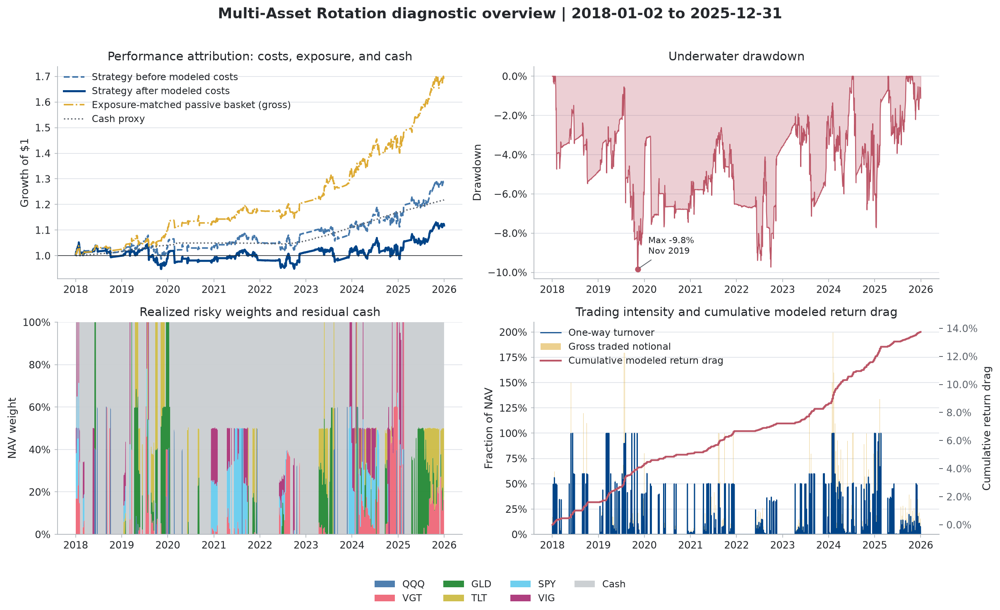

| Audited result | Value |
|---|---:|
| Net nominal CAGR | +1.40% |
| Gross nominal CAGR before modeled costs | +3.17% |
| Net Sharpe, excess of SHV | -0.15 |
| Gross Sharpe, excess of SHV | +0.14 |
| Maximum drawdown | -9.83% |
| Annualized one-way turnover | 10.30x |
| Annualized gross traded notional | 13.25x |
| Mean risky exposure | 30.14% |
| Fully-cash sessions | 47.94% |
| Realized-exposure attribution-control Sharpe, gross | +0.80 |
| Target-exposure comparator Sharpe, after costs | +0.62 |
| Annualized arithmetic net excess over SHV | -0.90% |
| Active risky-allocation contribution | -3.38% |
| Dynamic exposure-timing contribution | +0.30% |
| Passive risky-exposure contribution | +3.90% |
| Modeled implementation-cost contribution | -1.72% |

The positive nominal return is not evidence of positive active return. Before
costs, annualized arithmetic return relative to the realized-exposure
attribution control is -3.38%; the primary 21-session paired block-bootstrap
interval is [-5.85%, -0.90%]. Against a causal target-exposure comparator after
both sides pay modeled costs, the strategy shortfall is -4.14%
[-6.70%, -1.63%]. The corresponding conventional active Sharpe is -0.92 with a
block-bootstrap interval of [-1.47, -0.37].

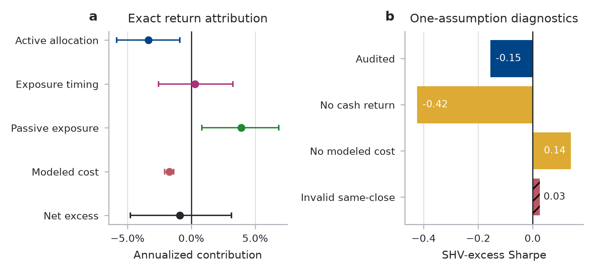

The left panel decomposes net excess over SHV exactly into active allocation,
exposure timing, passive exposure, and modeled cost. Active allocation includes
the return effect of share drift between rebalances, not only security
selection. The right panel shows one-assumption
diagnostics. Amber bars change economic assumptions; the red same-close bar
violates causality. None is a candidate strategy.

### Core diagnostics

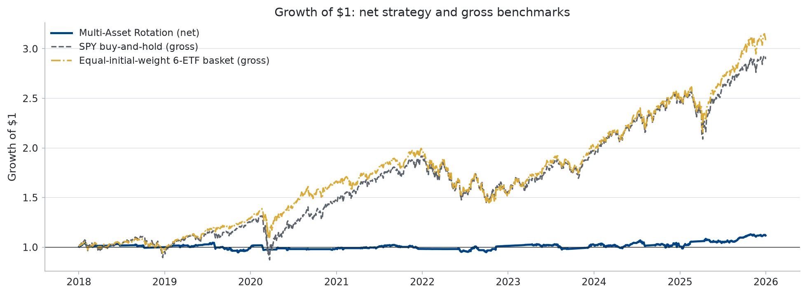

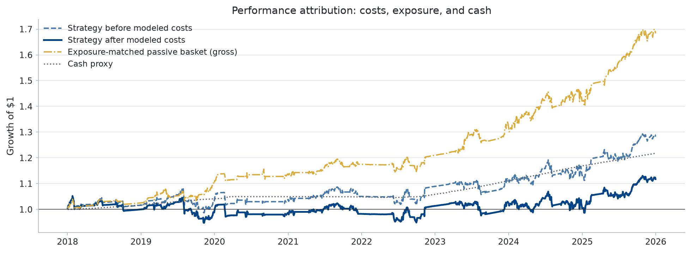

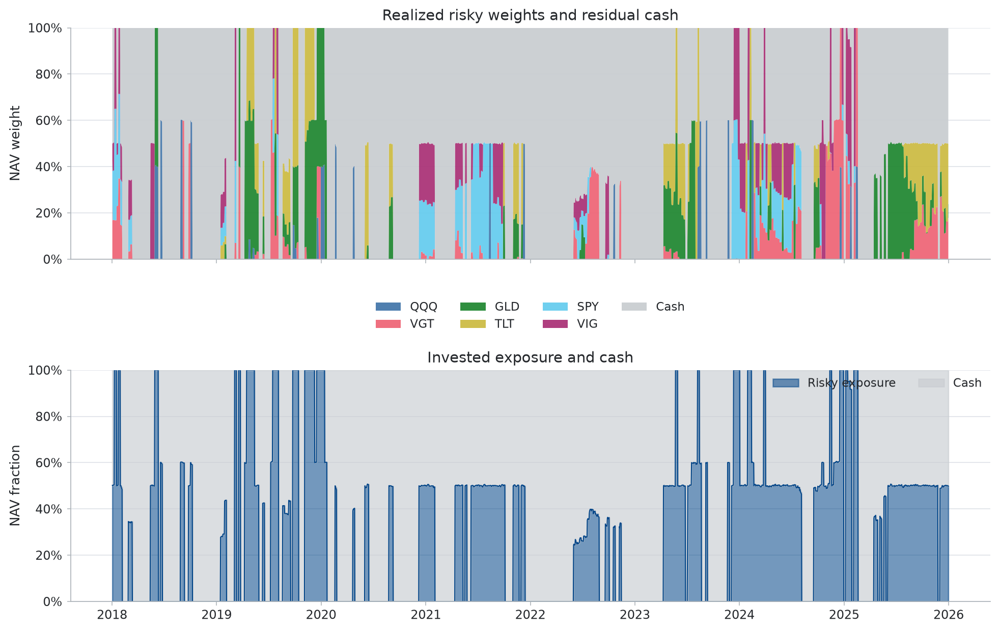

<details>
<summary><strong>Additional diagnostics</strong></summary>

#### Drawdown

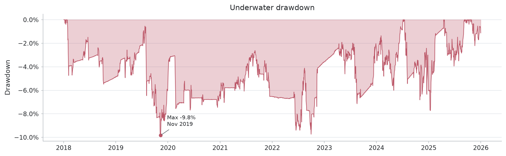

#### Rolling Sharpe

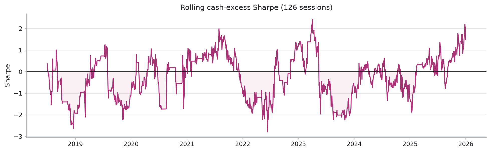

#### Rolling risk

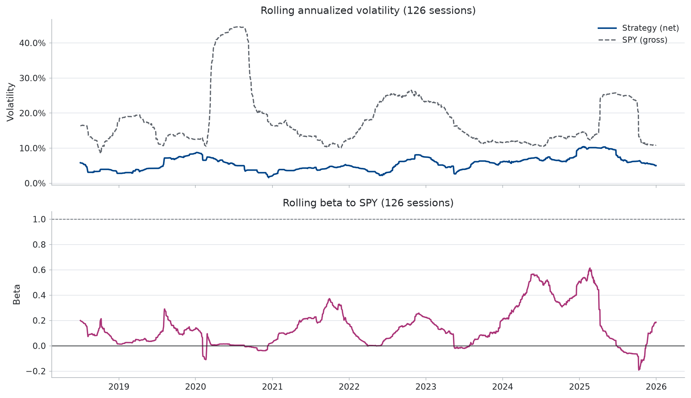

#### Turnover and costs

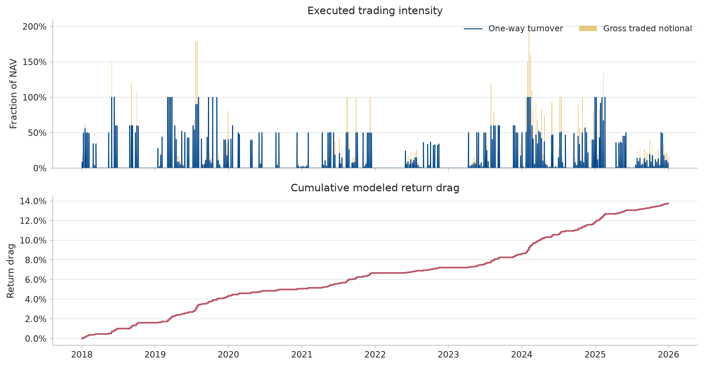

#### Monthly returns

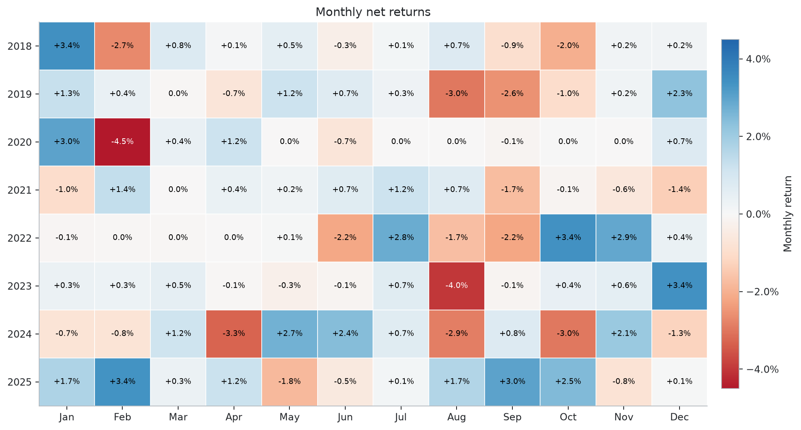

#### Return distribution

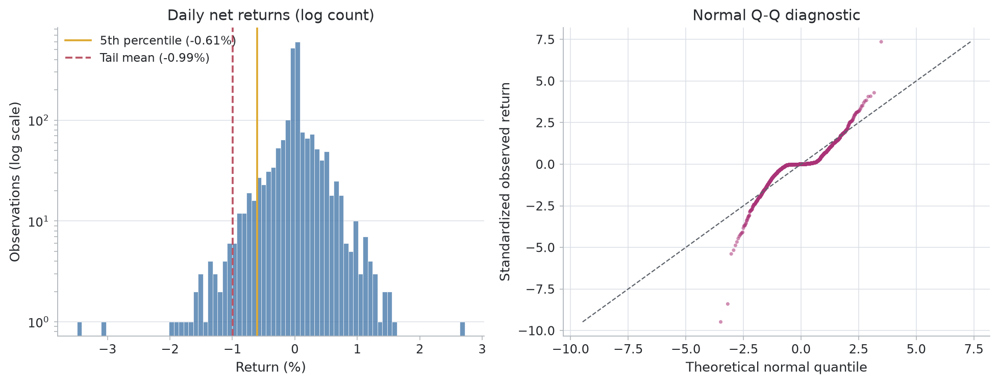

</details>

The repository owner authorizes publication of these derived charts. The raw
provider matrix is not committed. Its SHA-256 is
`efb384a62157e56a0cd8065abf45c1ed07d90ec26c681e5d54d74fe4cb9c55e1`;
chart hashes and provenance are recorded in
[`docs/img/performance_manifest.json`](docs/img/performance_manifest.json).
That owner-supplied authorization does not independently establish that the
provider's terms permit publication.

## Repository-Frozen Expansion

The paper also evaluates four fixed strategy families across U.S. sector and
country-equity ETF panels from 2018 through 2025. The protocol was committed
before either panel was requested, but it was not externally registered and the
historical interval is not a temporal holdout. All models use mature features,
next-bar execution, SHV residual cash, 13 bps per dollar traded, and 5,000 joint
circular-block draws.

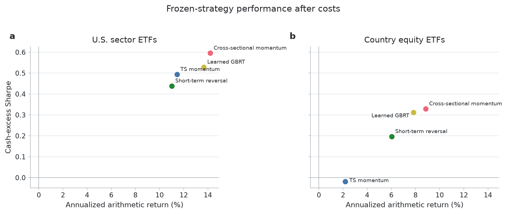

Seven of eight baseline sample Sharpes are positive, but these descriptive
outcomes are not alpha claims. The central result is sensitivity to evaluation
semantics:

| 21-session pointwise interval result | Cells out of 8 |
|---|---:|
| Removing modeled cost: above zero | 8 |
| Invalid same-close assignment: below / overlaps / above | 3 / 5 / 0 |
| Zero cash return: below / overlaps / above | 5 / 3 / 0 |
| Strategy minus costed exposure comparator: below / overlaps / above | 1 / 7 / 0 |

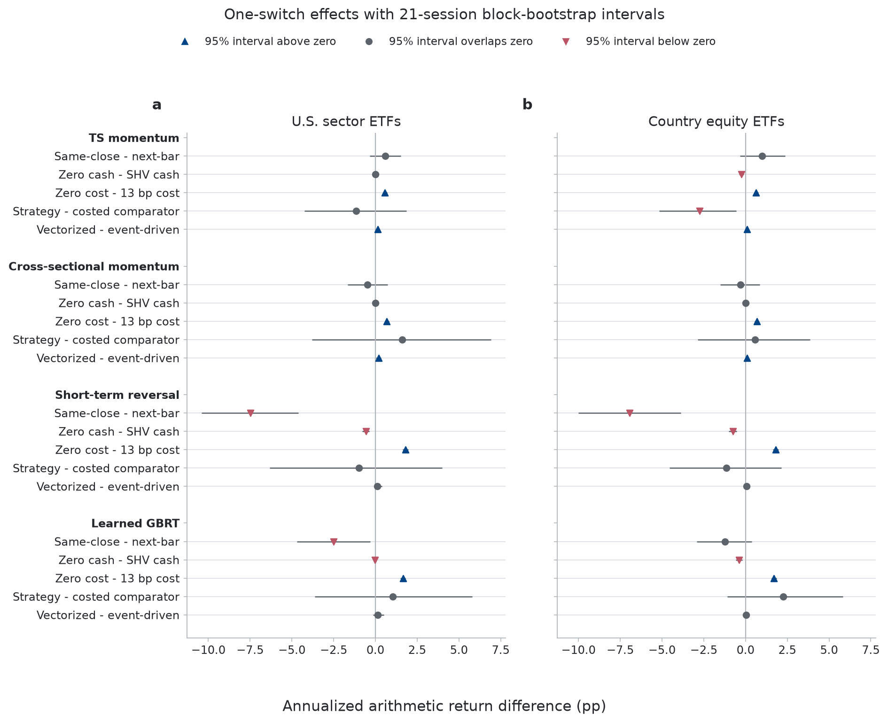

The intervals are pointwise, conditional on two selected panels, and not
multiplicity adjusted. Raw matrices are not distributed; panel digests, target
tape hashes, aggregate tables, source fingerprints, and figure hashes are in
[`paper/expansion/results/manifest.json`](paper/expansion/results/manifest.json).

## Research Paper

The [NeurIPS 2026-format public preprint](paper/quantcortex_audit_neurips2026.pdf)
formalizes the executable contracts, exact attribution, controlled protocol
diagnostics, the retrospective negative result, the repository-frozen expansion,
uncertainty, limitations, and provenance.
It is not represented as accepted by or submitted to NeurIPS.
An [anonymized preprint build](paper/quantcortex_audit_anonymous.pdf) is generated
from the same source and omits author and repository identifiers.

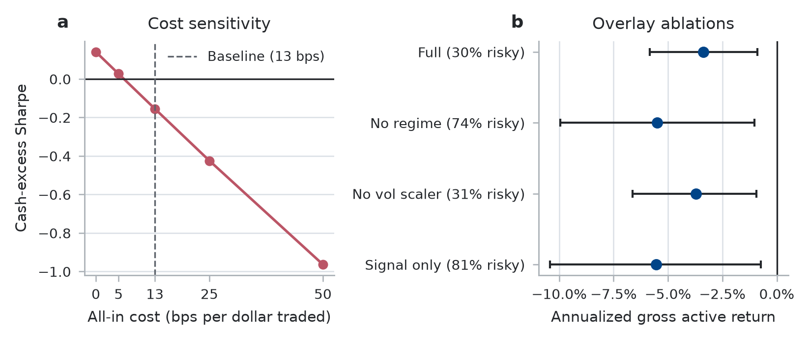

See [paper/README.md](paper/README.md) for the build and reproduction workflow.
Aggregate tables, generated paper values, source fingerprints, and artifact
hashes are committed under `paper/results/` and `paper/expansion/results/`.

## Quick Start

```bash
git clone https://github.com/magnaquant/quantcortex.git
cd quantcortex
python3.11 -m venv .venv
source .venv/bin/activate
python -m pip install -r requirements/dev.lock
python -m pip install --no-deps -e .
```

Run the same offline gates used by CI:

```bash
python -m pytest tests/ -q --cov=quantcortex --cov-fail-under=60
ruff check .
PYTHONPATH=. python scripts/verify_brokers.py
```

Optional providers, broker SDKs, NLP, gradient-boosting, reinforcement-learning,
and storage clients are installed through Poetry extras. They remain lazy
imports so the scientific core can run without credentials or native ML
runtimes.

```bash
poetry install --with test,dev -E all
```

On macOS, LightGBM and XGBoost may require `brew install libomp`.

## Research Workflows

Local market data belongs under ignored `local_data/`; schemas and provenance
requirements are documented in [local_data/README.md](local_data/README.md).
The repository never replaces a failed real-data load with generated performance
numbers.

```bash
# Generate the ten-plot local performance report.
PYTHONPATH=. python scripts/generate_report.py \
  --prices-csv local_data/published_rotation_prices.csv \
  --cash-proxy-symbol SHV

# Regenerate reviewed README charts and paper artifacts from a clean commit.
scripts/release_paper_artifacts.sh \
  local_data/published_rotation_prices.csv

# Regenerate the reviewed expansion aggregates and figures from a clean commit.
scripts/release_expansion_artifacts.sh local_data/expansion

# Explicit live-data diagnostics; review the provider's terms first.
python scripts/validate_performance.py --live-yfinance
python scripts/survivorship_demo.py --live-yfinance

# Full offline research-to-order lifecycle; no broker calls.
python scripts/paper_trade_cycle.py --offline
```

Research notebooks are unexecuted in Git and validated in CI. Choose exactly
one adjusted-close source: `QUANTCORTEX_PRICES_CSV` or
`QUANTCORTEX_LIVE_YFINANCE=1`. A local run of the Alpha158 notebook also needs
`QUANTCORTEX_OHLCV_CSV`. To run the full notebook set from local files:

```bash
export QUANTCORTEX_PRICES_CSV="$PWD/local_data/prices.csv"
export QUANTCORTEX_OHLCV_CSV="$PWD/local_data/aapl_ohlcv.csv"
jupyter lab research/
```

Live yfinance use requires the explicit `QUANTCORTEX_LIVE_YFINANCE=1` opt-in
and remains subject to the provider's terms.

## Architecture

Importable code lives under the single `quantcortex` package.

| Layer | Responsibility |
|---|---|
| `data` | Provider adapters, local CSV validation, calendars, PIT merges, storage, universes |
| `alpha` | Classical, ML, and NLP factors plus validation utilities |
| `portfolio` | Weight contracts and portfolio allocators |
| `timing` | Regime, momentum, and volatility exposure overlays |
| `risk` | Drawdown, VaR/CVaR, factor, volatility, and Kelly controls |
| `backtest` | Vectorized/event-driven engines, costs, fills, metrics, research validation |
| `execution` | Pre-trade risk, order translation, broker adapters, coherent state persistence |
| `strategies` | End-to-end strategy pipelines using the shared contracts |

See [docs/architecture.md](docs/architecture.md) for module boundaries,
accounting semantics, and extension rules.

## Safety and Scope

Verified offline evidence includes the core test suite, lint, package builds,
notebook execution, deterministic paper artifacts, SDK request construction,
and broker behavior against faithful mocks. These checks do not establish:

- authenticated broker connectivity, permissions, or venue-side idempotency;
- production data rights, delisted-security coverage, or exact filing timestamps;
- calibrated spread, capacity, or market-impact estimates;
- operational recovery, monitoring, incident response, or regulatory approval.

Treat the unresolved controls in
[docs/production-readiness.md](docs/production-readiness.md) as release blockers
before using production capital. Security reporting is documented in
[SECURITY.md](SECURITY.md).

## Documentation

- [PERFORMANCE.md](PERFORMANCE.md): metric definitions, reporting rules, and limitations
- [docs/architecture.md](docs/architecture.md): package and contract design
- [docs/evaluation-contracts.md](docs/evaluation-contracts.md): target-tape schema and evidence classes
- [docs/data-source-due-diligence.md](docs/data-source-due-diligence.md): publication-data acceptance rules
- [docs/production-readiness.md](docs/production-readiness.md): external release gates
- [paper/README.md](paper/README.md): paper reproduction and submission constraints
- [paper/COMPUTE.md](paper/COMPUTE.md): reviewed host and release wall times
- [paper/preregistration.md](paper/preregistration.md): repository-frozen expansion protocol; not an external registry entry
- [local_data/README.md](local_data/README.md): accepted local-data schemas and provenance
- [CONTRIBUTING.md](CONTRIBUTING.md): contribution workflow
- [AGENTS.md](AGENTS.md): concise repository guidance for coding agents
- [CLAUDE.md](CLAUDE.md): detailed implementation constraints

## License

MIT licensed. Past simulated performance does not imply future results.
